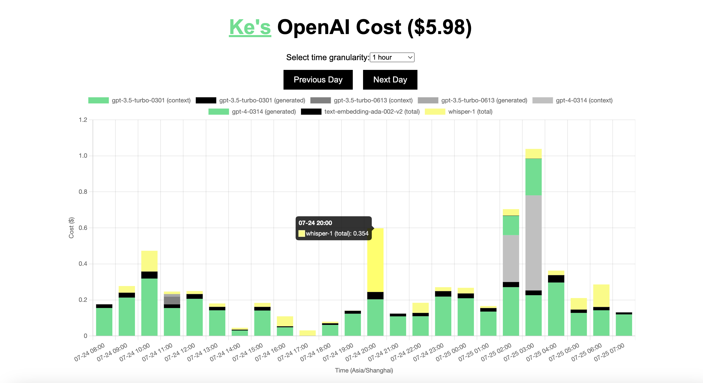
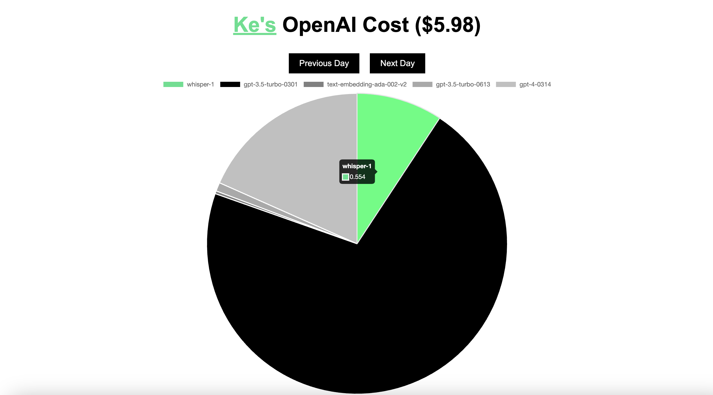

# api-usage
Track your OpenAI API usage with [apiusage.info](https://apiusage.info/) to effortlessly view the costs consumed by different models.




# Introduction
Enter your OpenAI API Key to view the costs consumed by various model APIs over the past day. It shows the usage of all the cost-incurring models from the previous day on an hourly basis. You can switch to a pie chart to see the cost proportion of each model.

# Security
The code is open-source and will not store your privacy, your API Key is only stored locally in `localStorage`.

# Run Yourself
Clone this project, run below in command line:
```bash
export OPENAI_API_KEY="YOUR_API_KEY"
python app.py
```

# Contribution
This project is to facilitate myself: I call a variety of OpenAI API models: `gpt-3.5/gpt-4/text-embedding/whisper`, but the daily bill does not display their respective proportions. Sometimes I find the expenses from the previous day to be unusually high, but can't pinpoint the reason. So I wrote this tool for myself, when the cost is abnormal, it allows me to conveniently check where the high consumption is. Current features are rather rudimentary, if you have better display forms and requirements, you are welcome to submit a PR.
